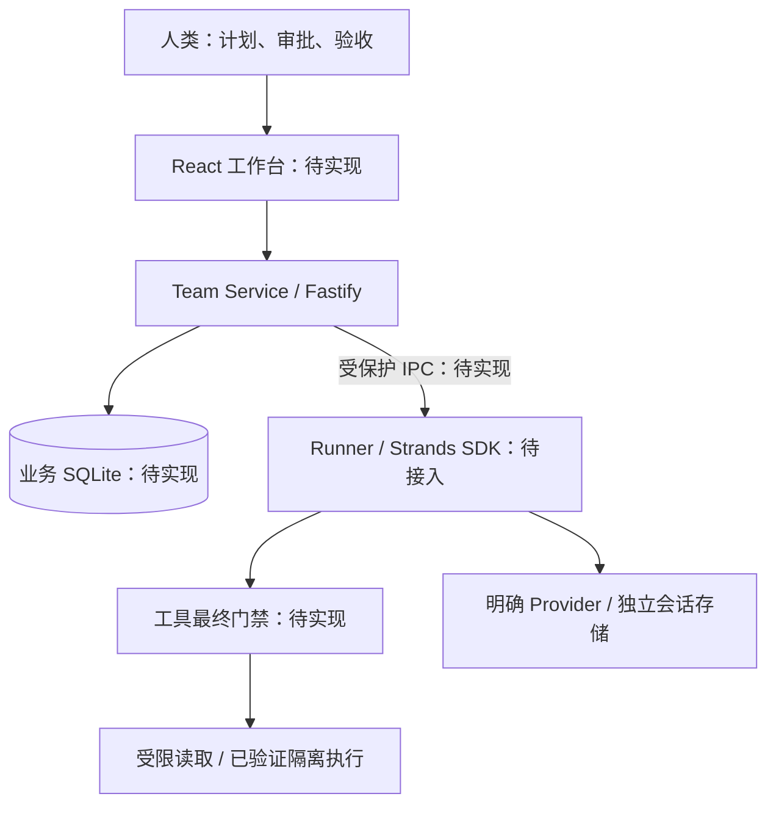

# Codex Agent Team

围绕任务组织专业角色，在明确授权、固定能力与受控工作区内完成实现、评审、交接和人类验收。项目采用 **Strands TypeScript SDK 作为执行架构基础**：Team Service 管业务，Runner 管 Agent 执行，工具边界管真实动作。

当前处于工程初始化阶段：已有 TypeScript/Fastify 骨架、健康检查及检查脚本；尚未接入 Strands、Provider、业务 SQLite、任务工作台或隔离执行。`/health` 的成功只表示服务可响应，Runner 状态为 `NOT_CONFIGURED`。

## 从这里开始

- [完整开发指引](docs/development-guide.md)：产品流程、模块职责、数据/命令契约、授权、恢复、R0–R5 开发与验收顺序。
- [架构采纳记录 ADR-001](docs/decisions/001-strands-runtime-foundation.md)：新基础、旧方案覆盖关系及当前边界。
- [原始 Strands 方案](docs/v3-0925/codex-agent-team-strands-runtime-proposal-2026-09-25/docs/strands-runtime-foundation-proposal.md)：技术依据及 RT01–RT32 验收目标。
- [开发规则](AGENTS.md)：供开发者及 Agent 使用的必要约束。
- [实施队列](.codex/agent-state/todo.md)：当前进度、证据和下一项工作；计划不代表后续执行已获授权。

## 快速开始

需要 Node.js 24；本次基线为 `.nvmrc` 指定的 `24.16.0`，npm `11.13.0`。已安装相应 Node 时，在仓库根目录执行：

```bash
npm ci --ignore-scripts --no-audit --no-fund
npm run check
npm run dev:server
```

服务只监听 `http://127.0.0.1:4310`。另一个终端可以检查：

```bash
curl http://127.0.0.1:4310/health
```

响应：

```json
{ "ok": true, "phase": "bootstrap", "runtime": "NOT_CONFIGURED" }
```

安装会连接 npm registry 并创建 `node_modules/`；这里禁用依赖安装脚本，当前骨架不需要它们。未来引入原生 SQLite 驱动时，先审阅必要的构建脚本，再更新安装说明。遇到默认 npm cache 不可写时，可在命令中添加 `--cache /private/tmp/codex-agent-team-npm-cache`；不必修改用户全局 cache 权限。

当前不需要 `.env` 或模型密钥。健康服务不创建数据库，不调用模型。停止开发服务使用 Ctrl+C。

## 命令

| 命令 | 用途与效果 |
|---|---|
| `npm run dev:server` | 运行本地健康服务，占用 loopback 4310 端口 |
| `npm run build` | 编译服务、Runner 检查入口及共享代码到 `dist/` |
| `npm run start:server` | 运行构建后的健康服务；先执行 build |
| `npm run runner:check` | 检查当前 Runner 状态；当前输出 `NOT_CONFIGURED` 并返回非零退出码 |
| `npm run typecheck` | strict 类型检查 |
| `npm test` | bootstrap 测试，无真实模型或业务数据库 |
| `npm run check` | 类型检查、测试和构建；不启动 Agent |

这些命令不执行用户项目的测试、脚本或依赖安装；产品未来运行项目代码仍须经过独立隔离边界。

## 架构



Team Service 是业务唯一写入者。Runner 不直写业务数据库，模型自述不构成审批，SDK 正常结束不自动使任务 `done`。技术交付、交接接收及人类验收分别记录。

## 目录

```text
server/       Team Service；当前仅健康接口
runner/       执行控制与 SDK 适配；当前仅未配置检查
shared/       本项目跨边界类型；当前仅健康契约
web/          React + Vite 工作台预留
migrations/   业务数据库迁移预留
roles/        固定版本角色定义预留
skills/       本项目固定版本 Skill 预留
tests/        bootstrap 测试，后续按切片加入行为验证
docs/         当前开发指引、ADR 和原始历史资料
.codex/       项目索引、计划及实施队列
```

完整目标职责与引入时点见开发指引 §3、§12。目录存在不表示该模块已实现。

## 开发与贡献

先读取 AGENTS.md 和与任务相关的指引章节；按一个可验证切片修改，保持单锁文件，交付前执行 `npm run check`。业务行为变化需验证成功路径及材料风险对应的拒绝/故障路径。真实 SQLite、SDK、Provider 和隔离结果分别记录，不能用 mock 或编译替代。

新依赖按当前切片引入并固定版本；不复制历史材料中的滚动版本号，不引入尚无消费者的抽象。所有模型调用必须明确模型、凭据来源、数据去向与预算；不复用 Codex 私有认证。不默认自动切换模型、启动子 Agent、写长期记忆、推送或部署。

## 历史资料

`docs/v3-0925/` 保存 Strands 原方案及交接包；`docs/v2-0924/`、`docs/backup/`、旧交接文档和 `read.md` 用于追溯。原文件保持原样。当前架构效力以 ADR-001 为准，不将历史“未采纳”状态误当作本次决定，也不将这次架构采纳误当作全部运行门槛已通过。
