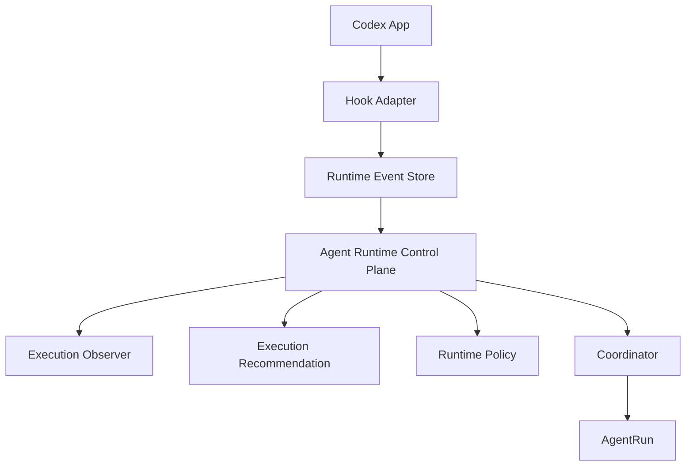

# Codex Agent Runtime Control Plane 设计方案

> Version: Proposed v0.1  
> Status: Design Proposal  
> Target: codex-agent-team  
> Based on: Codex Team 角色驱动的软件交付方案 v0.5  
>
> 本文定义 Codex Agent Runtime Control Plane，用于管理 Agent 执行过程中的状态观察、上下文交接、运行配置变更和资源使用控制。

---

# 1. 背景

## 1.1 问题

Codex Team 已经具备：

- Mission 管理
- Task 拆解
- Role 定义
- Coordinator
- AgentRun
- Evidence
- Technical Handoff

能够支持：

> 多角色 Agent 协作完成软件交付。


但是长周期任务存在新的问题：

一个复杂任务通常经历：

```text
Discovery
    |
Architecture
    |
Implementation
    |
Debug
    |
Validation
````

不同阶段对于 Agent 能力要求不同。

例如：

| 阶段   | 主要需求    |
| ---- | ------- |
| 架构设计 | 高推理能力   |
| 技术选型 | 高不确定性处理 |
| 代码实现 | 执行能力    |
| 测试修复 | 快速迭代    |
| 文档整理 | 低成本执行   |

如果整个任务始终使用最高能力 Agent，会导致：

* token 消耗过高；
* 上下文持续膨胀；
* 简单任务消耗高级模型资源；
* 接近上下文限制时质量下降。

---

# 2. 设计目标

## 2.1 目标

建立：

> Agent Runtime Control Plane

实现：

* Agent 运行状态观察；
* Token 使用感知；
* Context Pressure 检测；
* Agent Handoff；
* Runtime Policy 管理；
* 执行过程审计。

---

## 2.2 非目标

本系统不负责：

* 自动决定业务目标；
* 自动修改任务范围；
* 自动升级模型权限；
* 自动增加 Token 预算；
* 后台持续运行 Scheduler；
* 隐式 Runtime Mutation。

---

# 3. 核心设计原则

## 3.1 Observation / Decision / Execution 分离

系统必须保持：

```text
Observation

发现状态

      |

Decision

产生决定

      |

Execution

执行授权动作
```

禁止：

```text
Agent发现token不足

        |

自动切换模型
```

---

# 3.2 No Silent Runtime Mutation

任何 Runtime 变化必须显式记录。

包括：

* Model 修改；
* Effort 修改；
* Token Budget 修改；
* Agent 角色变化；
* Execution Environment 变化。

例如：

禁止：

```text
XHigh

↓

Ultra
```

静默发生。

必须产生：

```text
RuntimeDecision
```

---

# 3.3 Token 是观察指标，不是自动规则

错误：

```text
剩余20% Token

↓

自动切换Agent
```

正确：

```text
剩余20% Token

↓

产生 Budget Warning

↓

等待评估
```

---

# 4. 整体架构



---

# 5. 核心组件

# 5.1 Hook Adapter

## 职责

连接 Codex App 生命周期。

捕获：

* Agent Start
* Turn Complete
* Tool Call
* Error
* Finish

示例：

```json
{
  "event": "turn_completed",
  "run_id": "run_001",
  "usage": {
    "tokens": 120000
  }
}
```

---

# 5.2 Runtime Event Store

保存运行事件。

新增：

```text
RuntimeEvent
```

结构：

```sql
RuntimeEvent

id

attempt_id

event_type

timestamp

payload
```

事件类型：

```text
TOKEN_WARNING

CONTEXT_PRESSURE

PHASE_CHANGE

ERROR

BEFORE_FINISH

HANDOFF_REQUEST
```

---

# 5.3 Execution Observer

低成本观察层。

特点：

* 不运行高级 Agent；
* 不持续消耗 token；
* 不做自动决策。

负责：

## Token Observation

例如：

```yaml
budget:

total: 300000

used: 220000

remaining: 80000
```

产生：

```text
BudgetWarning
```

---

## Context Observation

检测：

* 历史消息长度；
* 工具调用数量；
* 输入规模。

产生：

```text
ContextPressure
```

---

## Phase Observation

检测任务阶段变化。

例如：

```text
Architecture

↓

Implementation
```

产生：

```text
PhaseTransition
```

---

# 6. Execution Recommendation

Agent 可以提出建议。

但是：

> Agent 只有 Recommendation 权，没有 Runtime 修改权。

示例：

```yaml
Recommendation:

current:

 model: ultra


phase:

 implementation


suggestion:

 model: xhigh


reason:

 - architecture completed
 - implementation remaining
 - uncertainty low
```

---

# 7. Runtime Policy

Runtime 变化必须受到授权约束。

新增：

```text
RuntimePolicy
```

示例：

```yaml
RuntimePolicy:

allowed_models:

  - max
  - ultra
  - xhigh


allowed_effort:

  - high
  - medium


budget:

 max_tokens: 500000


auto_transition:

 ultra_to_xhigh:

   enabled: true


auto_upgrade:

 enabled: false
```

---

# 8. Agent Handoff

## 8.1 定义

Handoff 不是：

> 换模型。

而是：

> 创建新的执行上下文。

---

## 8.2 生命周期

```text
AgentRun #001

Ultra

running


        |

        |

Handoff Proposal


        |

        |

Coordinator Decision


        |

        |

AgentRun #002

XHigh

running
```

---

# 9. Handoff Package

禁止复制完整聊天上下文。

生成：

```text
Continuation Package
```

内容：

```markdown
# Task Handoff


## Goal

当前任务目标


## Completed

已完成内容


## Current State

当前代码和环境状态


## Decisions

关键设计决定


## Rejected Options

已否决方案


## Remaining Work

剩余工作


## Validation

验证要求


## Risks

风险项
```

---

# 10. Agent 能力选择

不是：

```text
任务类型 -> 固定模型
```

而是：

```text
Task State

+

Uncertainty

+

Remaining Work

↓

Runtime Recommendation
```

---

## 示例

### Case 1

状态：

```text
架构完成

剩余：

代码实现
测试
```

推荐：

```text
Ultra

↓

XHigh
```

---

### Case 2

状态：

```text
发现架构问题

方向不确定
```

推荐：

```text
XHigh

↓

Ultra
```

但是：

需要授权。

---

# 11. Trigger Mechanism

## 11.1 不采用定时 Agent 检查

禁止：

```text
每5分钟启动一个Agent检查状态
```

原因：

监控成本可能超过节省成本。

---

## 11.2 Event Driven

触发来源：

### Hook Event

例如：

```text
turn_completed
```

---

### User Command

例如：

```text
/evaluate
```

或者：

```text
/handoff
```

---

### Runtime State Change

例如：

```text
Error

Phase Change

Before Finish
```

---

# 12. Human Control

人工触发是一等入口。

## 查看状态

```text
/status
```

输出：

```text
Current Agent:

Ultra


Phase:

Implementation


Token:

70% used


Recommendation:

Consider XHigh handoff
```

---

## 请求评估

```text
/evaluate
```

生成：

```text
Execution Review
```

---

## 请求交接

```text
/handoff
```

流程：

```text
Proposal

↓

Approval

↓

Create AgentRun
```

---

# 13. 数据模型扩展

## AgentRun

新增：

```text
runtime_policy_id

recommendation_id

decision_id
```

---

## RuntimeDecision

新增：

```sql
RuntimeDecision

id

type

from_runtime

to_runtime

reason

approved_by

timestamp
```

---

# 14. 与 Codex Team 集成

最终架构：

```text
Codex Team


Mission System

        |

Task System

        |

Role System

        |

Agent Runtime Control Plane

        |

AgentRun

        |

Evidence System
```

---

# 15. 核心流程总结

```text
Hook

↓

Runtime Event

↓

Execution Observer

↓

Recommendation

↓

Coordinator Decision

↓

Authorization Check

↓

AgentRun Execution

↓

Evidence Record
```

---

# 16. 最终原则

系统遵循：

```text
Hook负责发现

Event负责记录

Agent负责建议

Coordinator负责决策

Policy负责约束

AgentRun负责执行

Evidence负责证明
```

---

# 17. 定位

Codex Team 不应该成为：

> 自动选择模型的黑盒调度器。

而应该成为：

> 一个具备运行状态感知、上下文交接和显式授权控制能力的 Agent Runtime Control Plane。

最终目标：

> 让有限 Token 消耗在真正需要智能的地方，同时保持整个 Agent 生命周期可观察、可恢复、可审计。
